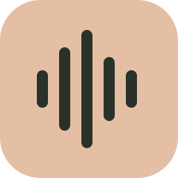
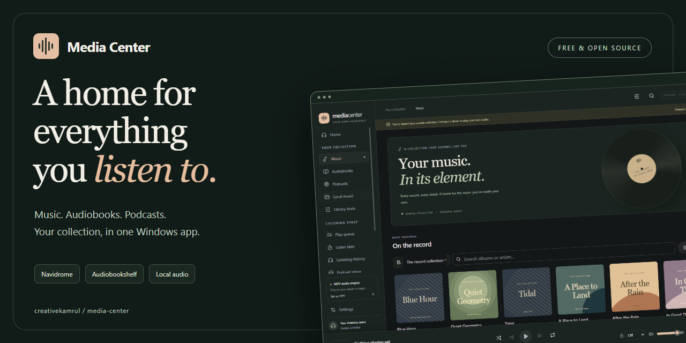
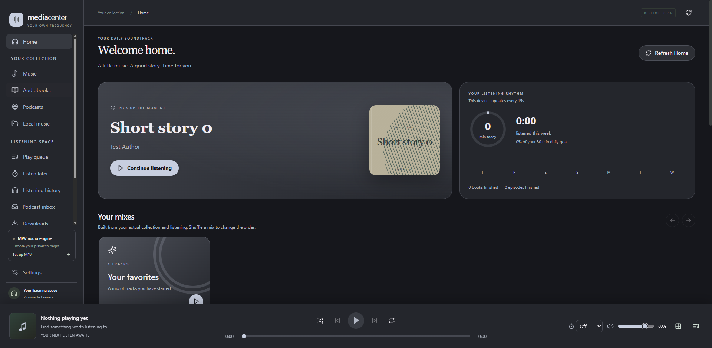
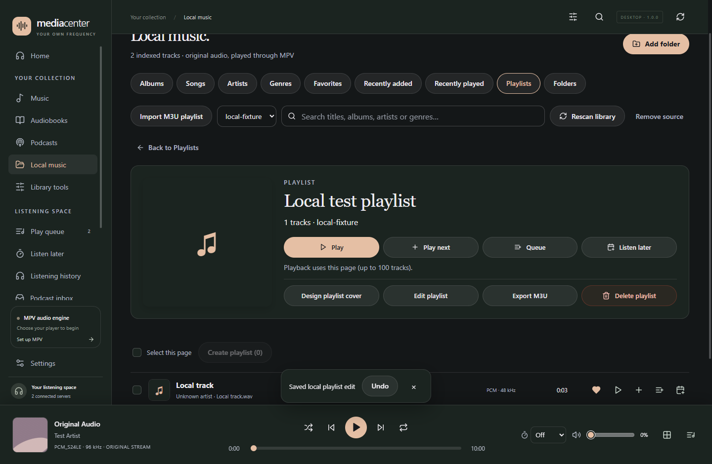
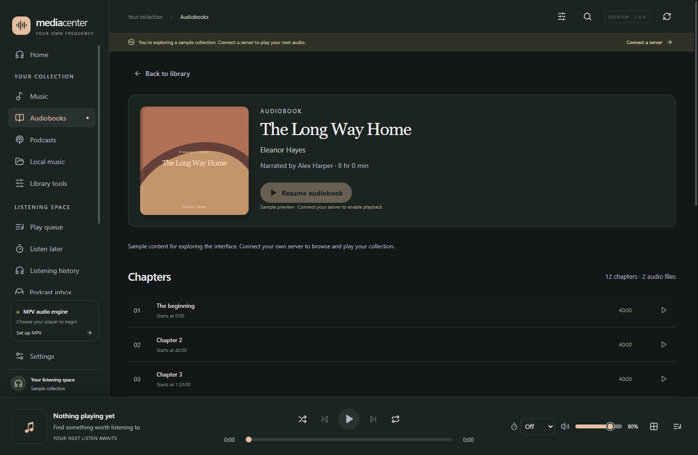
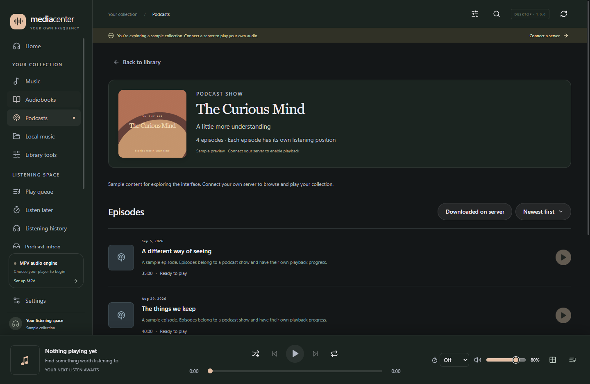
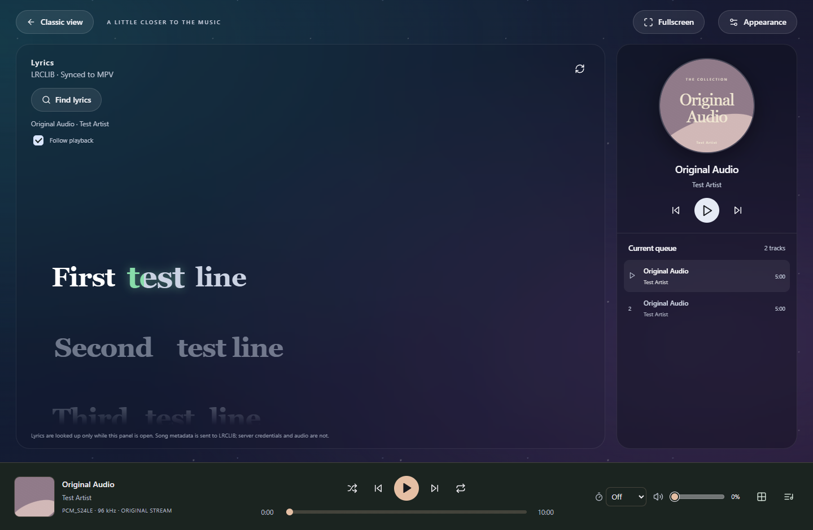
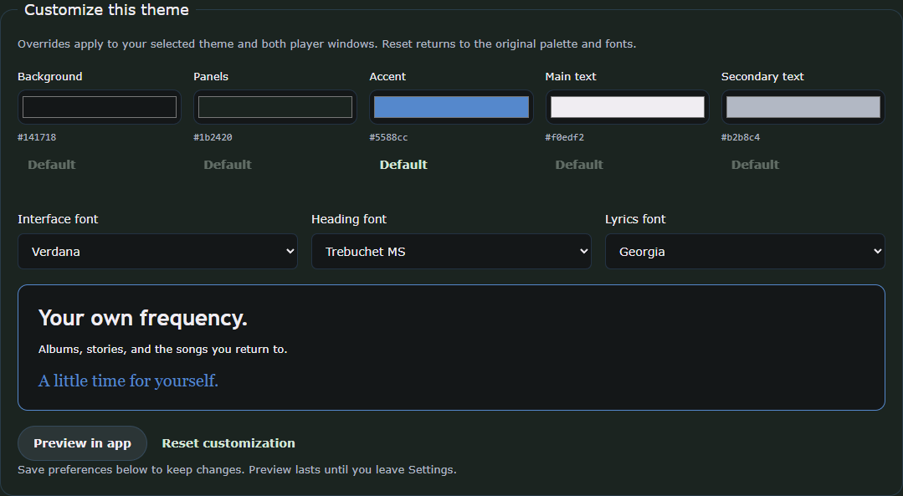
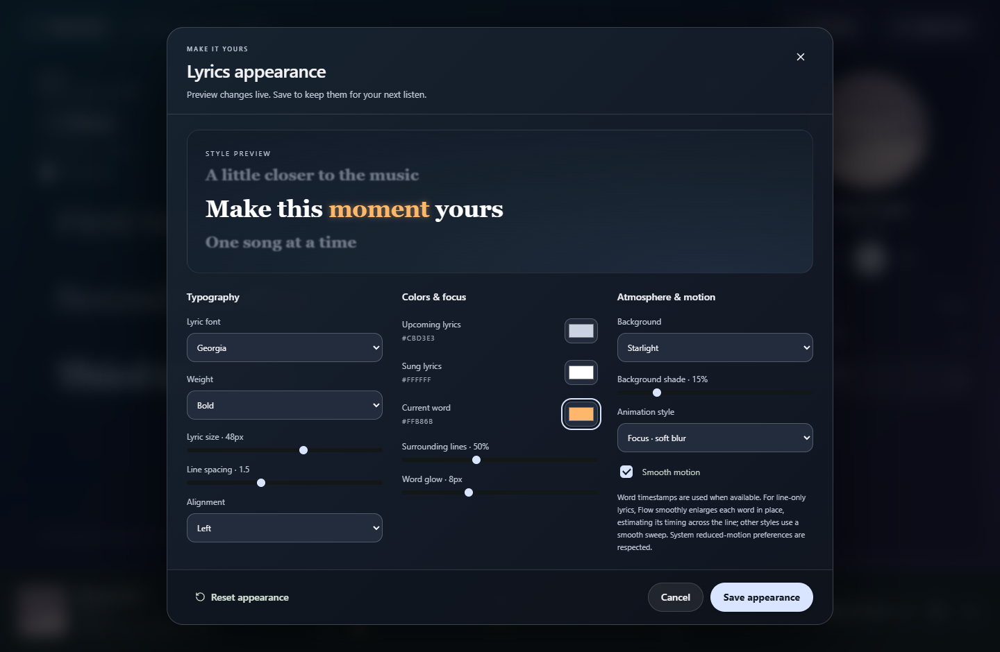
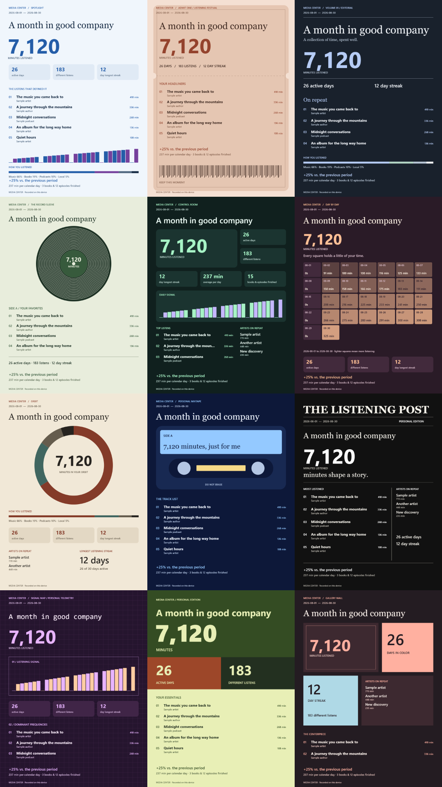

<div align="center">



# Media Center

### Your collection. Your own frequency.

A Windows desktop home for your music, audiobooks, podcasts, and local audio.<br>
Connect **Navidrome** and **Audiobookshelf**, and listen through **native MPV**.

[](https://github.com/creativekamrul/media-center/releases/latest)
[](https://github.com/creativekamrul/media-center/releases/latest)
[](LICENSE)

**[Download for Windows](https://github.com/creativekamrul/media-center/releases/latest)** · **[Visit the website](https://creativekamrul.github.io/media-center/)** · **[User guide](docs/USER-GUIDE.md)**

</div>



<p align="center"><sub>Real Windows app screenshots with sample collections and controlled playback test data. Media is not bundled.</sub></p>

## One home. Your whole collection.

Move from a favorite album to the next chapter without switching players. Media Center brings different kinds of listening together while keeping their details distinct: music has albums and tracks, books have chapters, and podcast shows have individual episodes.

| Bring your own | Make yourself at home |
| --- | --- |
| **Navidrome music** | Browse albums and artists, manage playlists, favorite tracks, rate songs, and build a queue. |
| **Audiobookshelf books** | Resume whole-book progress, navigate chapters across audio files, and sync listening back to your server. |
| **Audiobookshelf podcasts** | Browse shows and independent episodes, filter listening status, search, sort, and catch up through the podcast inbox. |
| **Local music library** | Browse tagged albums, songs, artists and genres; keep local favorites and playlists, or explore the original folder structure. Files stay untouched. |

## New in Media Center 1.2

- **Make your own mixes.** Combine artists, genres, years, favorites and grouped rules across music sources. Preview, save, duplicate and play your recipes.
- **Rediscover more music.** Browse beyond eight recently played albums and load more as you explore.
- **A cleaner collection.** Refreshed headers, compact action rows, organized right-click menus and optional Playlists below Home keep common actions close.
- **Keep every story in order.** Dedicated Continue listening grids for books and podcasts, plus searchable Finished episodes with replay and Mark unfinished.
- **Find the right cover.** MusicBrainz/Cover Art Archive searches fall back to Apple iTunes when needed. Preview covers in a square box before applying device-local changes.
- **More reliable everyday actions.** Fixes for artist playback, context menus, playback after metadata edits and collection pagination.

Personal shelves, metadata customization, offline plans, per-show podcast preferences, private listening and the themed mini player remain available.

**1.2.1 refinements:** consistent collection and episode actions, opaque More menus, playlist cover generation inside customization, redesigned Saved queues and independent queue scrolling in Now Playing.

**1.2.3 update:** Play custom mixes directly, explore dedicated artist pages, and enjoy larger artwork with aligned track columns. The artwork editor preview is fixed, and automatic lyrics check embedded local tags or Navidrome before LRCLIB.

[Read the 1.2.3 release notes](https://github.com/creativekamrul/media-center/releases/tag/v1.2.3) · [Full changelog](CHANGELOG.md)

## A closer look

<table>
<tr>
<td width="50%"><a href="site/assets/home.png"></a><strong>A familiar place to start.</strong><br>Home shelves, mixes and your daily listening.</td>
<td width="50%"><a href="site/assets/local-library.png"></a><strong>Your folders become a collection.</strong><br>Tagged albums, favorites, playlists and folders.</td>
</tr>
<tr>
<td width="50%"><a href="site/assets/audiobooks.png"></a><strong>Stories, with their place kept.</strong><br>Book progress and chapter navigation.</td>
<td width="50%"><a href="site/assets/podcasts.png"></a><strong>Every episode in its place.</strong><br>Shows, episode status, search, and sorting.</td>
</tr>
<tr>
<td width="50%"><a href="site/assets/immersive-player.png"></a><strong>A little closer to the music.</strong><br>Lyrics, soft backgrounds, and the current queue.</td>
<td width="50%"><a href="site/assets/customization.png"></a><strong>Make it feel like yours.</strong><br>Color and font controls with preview and reset. Solid or gradient surfaces, optional translucency and local CSS import.</td>
</tr>
<tr><td colspan="2"><a href="site/assets/lyrics-appearance.png"></a><strong>The words, your way.</strong><br>Live preview for normal and immersive lyric views.</td></tr>
</table>

<details>
<summary><strong>Twelve ways to remember your listening</strong></summary>



Each layout has its own composition. Choose the design, palette, title and dates independently; your data stays local until you export and share it.

</details>

Browse full-size screenshots on the **[landing page](https://creativekamrul.github.io/media-center/#explore)**. [Screenshot provenance](site/assets/README.md).

## Built for everyday listening

- **Original audio, native playback.** MPV handles your streams and local files, including FLAC, WAV, and MP3. ReplayGain, EQ, and exclusive output are optional.
- **A player that stays close.** A redesigned, theme-aware mini player with centered controls and a clear seek bar, editable queue, saved queues, sleep timer, fullscreen, and an immersive playing screen.
- **Lyrics you can keep.** Synchronized LRCLIB lyrics, manual search and preview, and a saved per-song match that stays in SQLite for offline use. Import LRC/TXT files or edit line timing locally.
- **Your own atmosphere.** Thirteen themes including Glass and Black Glass, custom colors, system font choices, a full lyric appearance popup, local CSS import, and reduced-motion support.
- **Make time for a good listen.** Listen Later plans, timestamped notes, listening history, and original-quality offline downloads.
- **Your listening, wrapped.** Local listening statistics and 12 distinct Recap designs, 12 palettes, rankings, streaks and date-range comparisons, exported as a PNG.
- **Share when you want to.** Optional Discord Rich Presence with public cover art from Last.fm. Sharing is configurable by media type.
- **Updates on your terms.** Check GitHub for a stable release, choose when to download, and restart to install from inside the app.

Media Center is actively developed. Full Feishin and Audiobookshelf web feature parity is the long-term goal; it is **not complete today**. See the [feature inventory](docs/FEATURES.md) for implemented features and remaining work, and the [changelog](CHANGELOG.md) for release details.

## Install and connect

1. **[Download the Windows x64 installer](https://github.com/creativekamrul/media-center/releases/latest)** and run the EXE. Current builds are unsigned.
2. Install [MPV](https://mpv.io/installation/) separately if needed, then select your `mpv.exe` in Settings. MPV is not bundled.
3. Connect Navidrome with its base URL, username, and password; or Audiobookshelf with its base URL and API key/access token.
4. For local audio, choose **Your collection → Local music → Add folder**.
5. Pick something worth listening to.

Already installed? Use **Settings → App updates → Check for updates**. Downloading and installation happen when you choose. Versions 0.2.1 and earlier need one manual upgrade to get the in-app updater.

**Compatibility baseline:** Windows, Navidrome **0.60.3**, Audiobookshelf **2.35.1**, and MPV **0.38+**. Other server versions and audio hardware need their own validation. [Setup and troubleshooting →](docs/USER-GUIDE.md)

## Your collection stays yours

Media Center is a client, not a media hosting service. Audio stays on your servers or in folders you select. MPV reads original streams; the renderer does not decode your audio or receive saved credentials. Original streaming alone is not a hardware bit-perfect guarantee.

Credentials use Electron `safeStorage` with Windows protection. SQLite stores settings, queues, local metadata, progress checkpoints, notes, lyric bindings, and listening history on your computer. No app analytics service is configured.

Optional lyric and cover lookups send relevant metadata to LRCLIB and Last.fm. Enabled Discord presence shares the activity you allow. Server progress synchronization is explicit and errors are visible; offline progress reconciliation currently requires a preview and confirmation. See the [user guide](docs/USER-GUIDE.md) for the exact behavior and backup limits.

## Develop

Built with **Electron · React · TypeScript · SQLite · MPV**. Requires Windows, Node.js 22+, npm, and the .NET 10 SDK for the Windows media-controls helper. Packaged users do not need .NET installed.

```powershell
git clone https://github.com/creativekamrul/media-center.git
cd media-center
npm ci
npm run build:media-controls
npm run dev
```

Select your own MPV executable in the development app. To verify a change:

```powershell
npm run typecheck
npm test
npm run test:updater
npm run build
npm run test:desktop
npm run package:win
```

For muted native playback tests, set `MPV_TEST_PATH` to your MPV executable. For packaged tests, also set `MEDIA_CENTER_EXECUTABLE` to `release\win-unpacked\Media Center.exe`. Tests use isolated fixture servers and profiles. Reports and screenshots go to ignored `artifacts/`; installers go to ignored `release/`.

Releases are built and tested by GitHub Actions, with corresponding source, update metadata, and checksums. See [releasing a version](docs/RELEASING.md). The landing page lives in `site/` and deploys independently through [GitHub Pages](docs/WEBSITE.md).

## Build it with us

Bug reports, testing, documentation, and code contributions are welcome. Start with [CONTRIBUTING.md](CONTRIBUTING.md), look through the [feature inventory](docs/FEATURES.md), or [open an issue](https://github.com/creativekamrul/media-center/issues). Please keep credentials, app databases, and private library data out of issues and pull requests. For security reports, follow [SECURITY.md](SECURITY.md).

| Project guide | What you'll find |
| --- | --- |
| [User guide](docs/USER-GUIDE.md) | Setup, controls, updates, and troubleshooting |
| [Architecture](docs/ARCHITECTURE.md) | Electron boundaries, persistence, and native playback |
| [API contracts](docs/API-CONTRACTS.md) | Provider behavior and media distinctions |
| [Feature inventory](docs/FEATURES.md) | What works and what's still ahead |
| [Validation](docs/VALIDATION.md) | Verification approach and compatibility limits |
| [Changelog](CHANGELOG.md) | Changes by release |

## License and acknowledgements

**GPL-3.0-only.** See [LICENSE](LICENSE) and [third-party notices](THIRD_PARTY_NOTICES.md).

Built around the work of [MPV](https://mpv.io/), [Navidrome](https://www.navidrome.org/), [Audiobookshelf](https://www.audiobookshelf.org/), [LRCLIB](https://lrclib.net/), and the wider open-source community. [Feishin](https://github.com/jeffvli/feishin) inspires the music experience; Media Center is an independent project.
